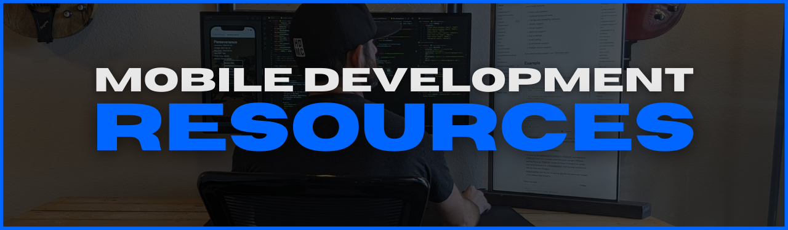

<!-- #region NAVIGATION -->

[discover](#discover) | [define](#define) | [market](#market) | [deliver](#deliver) | [evaluate](#evaluate)

&nbsp;&nbsp;&nbsp;
&nbsp;&nbsp;&nbsp;

<!-- #endregion /NAVIGATION -->

1. [`discover`](#discover) - entertain, educate, inform, save time, save money
2. [`define`](#define) - explicity define 'success' targets & constraints for each SDLC phase
3. [`market`](#market) - start solution awareness BEFORE touching any code
4. [`deliver`](#deliver) - deploy bare-minimum product for quickest user feedback
5. [`evaluate`](#evaluate) - use explicit criteria for deciding to "kill or iterate"

<!-- #endregion /INDEX -->

<!-- #region DISCOVER intro -->

<h3 id='discover'>

</h3>

<!-- #region NAVIGATION -->

[discover](#discover) | [define](#define) | [market](#market) | [deliver](#deliver) | [evaluate](#evaluate)

&nbsp;&nbsp;&nbsp;
&nbsp;&nbsp;&nbsp;

<!-- #endregion /NAVIGATION -->

<!-- #endregion /DISCOVER intro -->

<!-- #region DISCOVER content -->

## **_1. FIND PROBLEMS TO SOLVE_**

- [data.ai](https://www.data.ai/en/apps/ios/top/store-rank/feed/free/united-states/overall/ios-phone/) -- free analytics availabe w/out having to signup
- [Google Play Store](https://play.google.com/store/apps/top) appreviews
- [Apple Store]() app reviews
  - [theappstore.org](https://theappstore.org/) - requires turning off ad-blockers
  - [iTunes Search API](https://affiliate.itunes.apple.com/resources/documentation/itunes-store-web-service-search-api/) - endpoint for searching
  - [find.io](https://fnd.io/#/us/charts/iphone/top-grossing/all) - lets you search the iOS app charts without having to open iTunes on your device

## **_2. VALIDATE YOUR SOLUTION_**

- [Lean Canvas]() business plan
- [Competetive Market Analysis]()
- [SWAT Analysis]()

## **_3. STAY INDUSTRY-AWARE_**

### Blogs

- [React Native blog](https://reactnative.dev/blog)

### Podcasts

- [React Podcast](https://reactpodcast.simplecast.com/)
- [React Round Up](https://devchat.tv/podcasts/react-round-up/)
- [React Native Radio](https://reactnativeradio.com/)
- [The React Native Show](https://callstack.com/podcast-react-native-show)

### Newsletters

- [Awesome React Weekly](https://react.libhunt.com/newsletter/archive)
- [React Native Now](https://reactnativenow.com/issues)
- [React Wednesdays](https://www.telerik.com/react-wednesdays)

### Mobile Companies

- [Callstack.io](https://www.callstack.com/)
- [Infinite Red](https://infinite.red/)

### Open-Source Projects

- [40 Best Free And Open Source Android Apps in 2022](https://antonyagnel.com/best-free-and-open-source-android-apps/)
- [open-source React Native apps](https://github.com/ReactNativeNews/React-Native-Apps) repo

<!-- #endregion /DISCOVER content  -->

<!-- #region DEFINE intro -->

<h3 id='define'>

</h3>

<!-- #region NAVIGATION -->

[discover](#discover) | [define](#define) | [market](#market) | [deliver](#deliver) | [evaluate](#evaluate)

&nbsp;&nbsp;&nbsp;
&nbsp;&nbsp;&nbsp;

<!-- #endregion /NAVIGATION -->

<!-- #endregion /DEFINE intro -->

<!-- #region DEFINE content -->

## **_1. DEFINE FEATURES & REQUIREMENTS_**

## **_2. MAP OUT UI & UX_**

- [Bootswatch](https://bootswatch.com/) | free Bootstrap themes
- [Figma community](https://www.figma.com/community) | insperation goldmine design systems, wireframes, mobile design, web, ui kits

- Android [App quality guidelines](https://developer.android.com/quality)
- Android [Material Design guidelines](https://material.io/design)
- Android [Material Design components](https://material.io/develop/android)

- iOS [Human Interface guidelines](https://developer.apple.com/design/human-interface-guidelines/ios/overview/themes/)

- Canva | [creating a logo](https://designschool.canva.com/courses/creating-a-logo/?lesson=the-how-and-why-of-designing-logos)

## **_3. DESIGN APP ARCHITECTURE_**

- [12-Factor App](https://12factor.net/)
- [AWS](https://aws.amazon.com/architecture/reference-architecture-diagrams/?whitepapers-main.sort-by=item.additionalFields.sortDate&whitepapers-main.sort-order=desc&awsf.whitepapers-tech-category=*all&awsf.whitepapers-industries=*all&solutions-all.sort-by=item.additionalFields.sortDate&solutions-all.sort-order=desc) architecture diagrams
- [Azure](https://docs.microsoft.com/en-us/azure/architecture/browse/) architecture diagrams

## **_4. ROADMAP PROJECT SCHEDULE_**

- [Azure DevOps](https://azure.microsoft.com/en-us/services/devops/?nav=min)
- [GitHub Projects](https://docs.github.com/en/issues/trying-out-the-new-projects-experience/about-projects)
- [Trello](https://trello.com/)

## **_5. DESIGN BRANDING & MARKETING_**

- [Canva](canva.com)

<!-- #endregion DEFINE content -->

<!-- #region MARKET intro -->

<h3 id='market'>

</h3>

<!-- #region NAVIGATION -->

[discover](#discover) | [define](#define) | [market](#market) | [deliver](#deliver) | [evaluate](#evaluate)

&nbsp;&nbsp;&nbsp;
&nbsp;&nbsp;&nbsp;

<!-- #endregion /NAVIGATION -->

<!-- #endregion /MARKET intro -->

<!-- #region MARKET content -->

## **APP STORES**

- Apple Store: [Developers](https://developer.apple.com/app-store/), [Developer Program](https://developer.apple.com/programs/whats-included/), [Connect API](https://developer.apple.com/documentation/appstoreconnectapi)

- Google Play Store: [Console](https://developer.android.com/distribute/console?hl=ru), [Services](https://developer.android.com/distribute/play-services?hl=ru)

## **PRODUCT PAGE**

- [Start Bootstrap](https://startbootstrap.com/) | free Bootstrap site templates & themes

## **SALES**

- Conversion Analytics

- Features, Advantages, Benefits

- Genuine Value Prop

- Monetization Strategy

- Sales Tracking

- [Accelerate the Sale](https://www.amazon.com/Accelerate-Sale-Kick-Start-Personal-Selling/dp/0071760407) | book by Mark Rogers

## **USER PERSONAS**

- Personas

- Human Universals

<!-- #endregion /MARKET content -->

<!-- #region DELIVER intro -->

<h3 id='deliver'>

</h3>

<!-- #region NAVIGATION -->

[discover](#discover) | [define](#define) | [market](#market) | [deliver](#deliver) | [evaluate](#evaluate)

&nbsp;&nbsp;&nbsp;
&nbsp;&nbsp;&nbsp;

<!-- #endregion /NAVIGATION -->

<!-- #endregion /DELIVER intro -->

<!-- #region DELIVER content -->

## **_1. SPIN UP PROJECT_**

- [`ignite`](https://github.com/infinitered/ignite)
- [`react-native-boilerplate`](https://github.com/thecodingmachine/react-native-boilerplate/tree/master/template)
- [`react-native-template-typescript`](https://github.com/react-native-community/react-native-template-typescript)

## **_2. SET UP ENVIRONMENTS_**

- [Azure Data Studio](https://docs.microsoft.com/en-us/sql/azure-data-studio/?view=sql-server-ver15)
- [Insomnia](https://docs.insomnia.rest/insomnia/get-started)
- [Postman](https://learning.postman.com/docs/getting-started/introduction/)
- [Visual Studio Code](https://code.visualstudio.com/docs)
- [XCode](https://developer.apple.com/documentation/xcode/)

## **_3. BUILD IT_**

### **Native Mobile**

### **X-Platform Mobile**

### **State Management**

### **Data Fetching**

### **Security**

### **Debugging & Testing**

- [Flipper](https://fbflipper.com/)
- [Reactotron](https://github.com/infinitered/reactotron)
- [`react-devtools`](https://github.com/facebook/react/tree/main/packages/react-devtools)

- [Detox](https://github.com/wix/detox/) | mobile app end-to-end testing
- [Jest](https://jestjs.io/)
  - [configure](https://jestjs.io/docs/configuration)
  - [React Native](https://jestjs.io/docs/tutorial-react-native)
  - [Expo](https://docs.expo.dev/guides/testing-with-jest/)
  - [React Navigation](https://reactnavigation.org/docs/testing)
  - [async testing](https://jestjs.io/docs/tutorial-async)
- [`nock`](https://www.npmjs.com/package/nock) | "HTTP server mocking and expectations library for Node.js"
- [React testing docs](https://reactjs.org/docs/testing.html)
  - [recipes for common patterns](https://reactjs.org/docs/testing-recipes.html)
  - [environments](https://reactjs.org/docs/testing-environments.html)
  - [`jest-react`](https://github.com/facebook/react/tree/main/packages/jest-react)
- [React Native testing docs](https://reactnative.dev/docs/testing-overview)
  - [structure](https://reactnative.dev/docs/testing-overview#structuring-tests)
  - [unit](https://reactnative.dev/docs/testing-overview#unit-tests)
  - [integration](https://reactnative.dev/docs/testing-overview#integration-tests)
  - [components](https://reactnative.dev/docs/testing-overview#component-tests)
  - [end-to-end](https://reactnative.dev/docs/testing-overview#end-to-end-tests)
- [`react-native-testing-library` docs](https://callstack.github.io/react-native-testing-library/)
  - [`react-native-testing-library` repo](https://callstack.github.io/react-native-testing-library/)
- [React Query docs](https://react-query.tanstack.com/guides/testing)

  - "[Testing React Query](https://tkdodo.eu/blog/testing-react-query)"

- [Kevin Powel](https://www.youtube.com/kepowob)
- [Brad Traversy](https://www.youtube.com/c/TraversyMedia)
- [Jack Herrington](https://www.youtube.com/c/JackHerrington)

### **Tech**

- [Android](https://developer.android.com/reference)
  - [Android Studio](https://developer.android.com/docs)
  - [Kotlin](https://developer.android.com/kotlin)
- [Expo](https://docs.expo.io/)
- [iOS: Swift](https://developer.apple.com/documentation/swift)
  - [release notes](https://developer.apple.com/documentation/ios-ipados-release-notes)
- [React](https://reactjs.org/docs)
  - [repo](https://github.com/facebook/react)
- [React Native](http://reactnative.dev/docs/getting-started)
  - [repo](https://github.com/facebook/react-native/)
  - [components](https://github.com/facebook/react-native/tree/main/Libraries/Components)
  - [community repo](https://github.com/react-native-community)
  - [community releases repo](https://github.com/react-native-community/releases)
  - [`react-native-vector-icons` repo](https://github.com/oblador/react-native-vector-icons)
    - [icon directory](https://oblador.github.io/react-native-vector-icons/)
- [TypeScript](https://www.typescriptlang.org/)
  - [TypeScript + React Native](https://reactnative.dev/docs/typescript)
  - [TypeScript + Expo](https://docs.expo.dev/guides/typescript/)
  - [React/TypeScript cheatsheet](https://github.com/typescript-cheatsheets/react) (_for typing React components_)

### **UI & Styling**

- [React Native component libraries](https://docs.expo.dev/guides/userinterface/)
- "[5 Ways To Improve React Native Styling Workflow](https://reactnavigation.org/docs/testing)" | Shopify

  1. design system: spacing, color, typography
  2. theme object
  3. provide theme using React.Context
  4. break system into components with props that only accept theme values
  5. use responsive styles (aka. breakpoints)
  6. enforce with TypeScript

- [url encoding](https://ascii.cl/url-encoding.htm)

<!-- #region DEPLOY content -->

## **_1. DEPLOY RESOURCES_**

## **_2. PUBLISH TO APP STORES_**

## **iOS**

- [Apple Developer Program](https://developer.apple.com/)
  - enrollment [requirements](https://developer.apple.com/programs/enroll/)
  - Apple [Agreements & Guidelines](https://developer.apple.com/support/terms/#apple-developer-agreement)
- App Store [Small Business Program](https://developer.apple.com/app-store/small-business-program/)
- [Developing for the Apple App Store](https://www.apple.com/app-store/developing-for-the-app-store/)

## **ANDROID**

- [Google Play Console](https://developer.android.com/distribute/console/)

<!-- #endregion /DEPLOY content -->

<!-- #endregion /DELIVER content -->

<!-- #region EVALUATE intro -->

<h3 id='evaluate'>

</h3>

<!-- #region NAVIGATION -->

[discover](#discover) | [define](#define) | [market](#market) | [deliver](#deliver) | [evaluate](#evaluate)

&nbsp;&nbsp;&nbsp;
&nbsp;&nbsp;&nbsp;

<!-- #endregion /NAVIGATION -->

<!-- #endregion /EVALUATE intro -->

<!-- #region EVALUATE content -->

## **APP STORE SALES**

## **IN-APP METRICS**

## **PERONAL HABITS**

## **USER FEEDBACK**

<!-- #endregion /EVALUATE content -->
