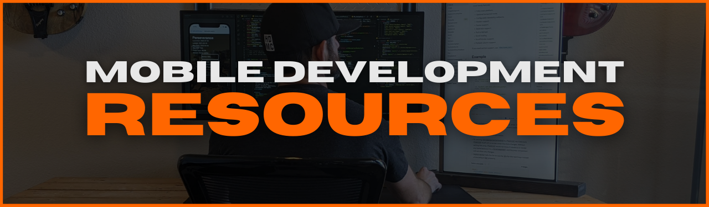
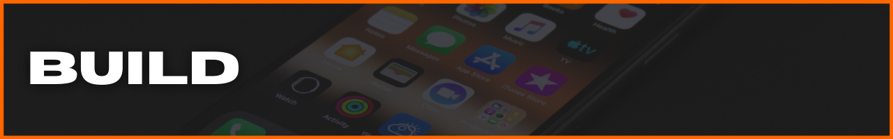
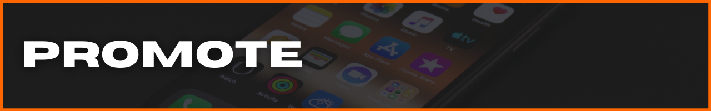
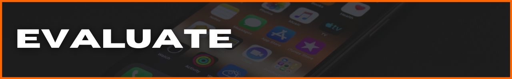

<!-- #region INDEX -->

[Getting Started](#start) | [Discover](#discover) | [Visualize](#visualize) | [Build](#build) | [Promote](#promote) | [Distribute](#distribute) | [Evaluate](#evaluate) | [Community](#community) | [Connect](#connect)

[`Getting Started`](#start)

Phase #1: [`Discover`](#discover)

Phase #2: [`Visualize`](#visualize)

Phase #3: [`Build`](#build)

Phase #4: [`Promote`](#promote)

Phase #5: [`Distribute`](#distribute)

Phase #6: [`Evaluate`](#evaluate)

[`Community`](#community)

[`Connect`](#connect)

<!-- #endregion /INDEX -->

<!-- #region GETTING STARTED -->

<h3 id='start'>

</h3>

[Getting Started](#start) | [Discover](#discover) | [Visualize](#visualize) | [Build](#build) | [Promote](#promote) | [Distribute](#distribute) | [Evaluate](#evaluate) | [Community](#community) | [Connect](#connect)

_Getting started is the hardest part. Stop making excuses._

## **PROTECT YOUR ASS(ETS)**

- _setting up an LLC / corp._

## **MENTAL APPROACH**

- _First few ( and then some ) ideas, apps, processes will be garbage. Just get the reps in ASAFP!_

## **HAVE A SYSTEM** ( for _EVERYTHING_ )

- _finding ideas_
- _visualizing the finishline ( EVERY TIME )_
- _building fast to start the feedback loop ASAP_
- _promote ( aka: communicate value )_
- _get your SOLUTION in the hands of users FAST_
- _maintain awareness of what's working & what's not_

## **APP STORE ACCOUNTS**

- _Apple App Store_
- _Google Play Store_

<!-- #endregion /GETTING STARTED -->

<!-- #region DISCOVER -->

<h3 id='discover'>

</h3>

[Getting Started](#start) | [Discover](#discover) | [Visualize](#visualize) | [Build](#build) | [Promote](#promote) | [Distribute](#distribute) | [Evaluate](#evaluate) | [Community](#community) | [Connect](#connect)

_Create a system to brainstorm & (in)validate app ideas **FAST**._

## **MOBILE INDUSTRY STATS**

constant awareness of where consumers spend their money

- [data.ai](https://www.data.ai/en/apps/ios/top/store-rank/feed/free/united-states/overall/ios-phone/) -- free analytics availabe w/out having to signup

## **EXISTING APPS**

what do people like / dislike about existing solutions

- [Google Play Store](https://play.google.com/store/apps/top) appreviews
- [Apple Store]() app reviews
  - [theappstore.org](https://theappstore.org/) - requires turning off ad-blockers
  - [iTunes Search API](https://affiliate.itunes.apple.com/resources/documentation/itunes-store-web-service-search-api/) - endpoint for searching
  - [find.io](https://fnd.io/#/us/charts/iphone/top-grossing/all) - lets you search the iOS app charts without having to open iTunes on your device

## **VALIDATE THE IDEA**

objectively attempt to INVALIDATE your idea - if you can't, it's game on

- **LEAN CANVAS**

- **COMPETITIVE MARKET ANALYSIS**

- **SWAT**

> **_:bangbang: NOTE TO SELF :bangbang:_**
>
> _if I'm in this for the long haul, I have to be the most objective person in the process_
>
> - build interest/user base **_then_** worry about monetizing
> - love the problem, not the idea

<!-- #endregion /DISCOVER -->

<!-- #region VISUALIZE -->

<h3 id='visualize'>

</h3>

[Getting Started](#start) | [Discover](#discover) | [Visualize](#visualize) | [Build](#build) | [Promote](#promote) | [Distribute](#distribute) | [Evaluate](#evaluate) | [Community](#community) | [Connect](#connect)

_Minimize unecessary decision-making, time-sucks, and low-ROI tasks by creating a system that keeps you focused on the current step's primary objective._

- benchmark dates
- Lean Canvas business plan (**_every_** app is a business)
- **_bare minimum_** v1 requirements (features & functionality)
- required tech resources & architecture
- UI wireframes
- development & testing
- user-testing
- evaluate user-testing feedback
- decide to iterate or start next idea

**BIG PICTURE**

- [Lean Canvas]()

**TECHNICAL REQUIREMENTS**

- [12-Factor App](https://12factor.net/)
- Architecture Diagrams: [AWS](https://aws.amazon.com/architecture/reference-architecture-diagrams/?whitepapers-main.sort-by=item.additionalFields.sortDate&whitepapers-main.sort-order=desc&awsf.whitepapers-tech-category=*all&awsf.whitepapers-industries=*all&solutions-all.sort-by=item.additionalFields.sortDate&solutions-all.sort-order=desc), [Azure](https://docs.microsoft.com/en-us/azure/architecture/browse/)
- _(add user testing & feedback)_

**GRAPHIC ASSETS**

- [creating a logo](https://designschool.canva.com/courses/creating-a-logo/?lesson=the-how-and-why-of-designing-logos)

**PROJECT LIFECYCLE**

- [Azure DevOps](https://azure.microsoft.com/en-us/services/devops/?nav=min)
- [GitHub Projects](https://docs.github.com/en/issues/trying-out-the-new-projects-experience/about-projects)
- [Trello](https://trello.com/)

**UI / UX DESIGN**

- Android: [App quality guidelines](https://developer.android.com/quality), [Material Design guidelines](https://material.io/design), [Material Design components](https://material.io/develop/android)
- iOS: [Human Interface guidelines](https://developer.apple.com/design/human-interface-guidelines/ios/overview/themes/)

> **_:bangbang: NOTE TO SELF :bangbang:_**
>
> - micro-slow, macro-fast
> - when it comes to learning, times practiced trumps time spent. **_it's all about the reps!_**

<!-- #endregion /VISUALIZE -->

<!-- #region BUILD -->

<h3 id='build'>

</h3>

[Getting Started](#start) | [Discover](#discover) | [Visualize](#visualize) | [Build](#build) | [Promote](#promote) | [Distribute](#distribute) | [Evaluate](#evaluate) | [Community](#community) | [Connect](#connect)

_Establish a build process that focuses on progress & leaves no time for perfection._

_"Perfect" is the enemy of "done"._

## **DEVELOPER ACCOUNTS**

- **iOS**

  - [Apple Developer Program](https://developer.apple.com/)
    - enrollment [requirements](https://developer.apple.com/programs/enroll/)
    - Apple [Agreements & Guidelines](https://developer.apple.com/support/terms/#apple-developer-agreement)
  - App Store [Small Business Program](https://developer.apple.com/app-store/small-business-program/)
  - [Developing for the Apple App Store](https://www.apple.com/app-store/developing-for-the-app-store/)

- **ANDROID**

## **DEV ENVIRONMENTS**

- [Azure Data Studio](https://docs.microsoft.com/en-us/sql/azure-data-studio/?view=sql-server-ver15)
- [Flipper](https://fbflipper.com/)
- [Reactotron](https://github.com/infinitered/reactotron)
- [Insomnia](https://docs.insomnia.rest/insomnia/get-started)
- [Postman](https://learning.postman.com/docs/getting-started/introduction/)
- [Visual Studio Code](https://code.visualstudio.com/docs)
- [XCode](https://developer.apple.com/documentation/xcode/)

## **READ THE F\*CK!NG MANUAL**

- Android: [Android Studio](https://developer.android.com/docs), [API reference](https://developer.android.com/reference), [Kotlin](https://developer.android.com/kotlin)
- Expo: [docs](https://docs.expo.io/)
- iOS: [Swift docs](https://developer.apple.com/documentation/swift), [release notes](https://developer.apple.com/documentation/ios-ipados-release-notes)
- React: [docs](https://reactjs.org/docs), [repo](https://github.com/facebook/react)
- React Native: [docs](http://reactnative.dev/docs/getting-started), [repo](https://github.com/facebook/react-native/), [community repo](https://github.com/react-native-community), [community releases](https://github.com/react-native-community/releases)
  - repo | [components](https://github.com/facebook/react-native/tree/main/Libraries/Components)
  - repo | [`react-native-vector-icons`](https://github.com/oblador/react-native-vector-icons)
  - repo | [`Icon` component](https://github.com/oblador/react-native-vector-icons#icon-component)
    - searchable [icon directory](https://oblador.github.io/react-native-vector-icons/)

## **SUBJECT MATTER EXPERTS**

- HTML / CSS
  - [Kevin Powel](https://www.youtube.com/kepowob)
- JAVASCRIPT
  - [Brad Traversy](https://www.youtube.com/c/TraversyMedia)
- REACT
  - [Jack Herrington](https://www.youtube.com/c/JackHerrington)

## **STREAMLINE**

- Project Boilerplates: [Ignite](https://github.com/infinitered/ignite), [react-native-boilerplate](https://github.com/thecodingmachine/react-native-boilerplate/tree/master/template), [react-native-template-typescript](https://github.com/react-native-community/react-native-template-typescript)

## **TOOLS**

- [url encoding](https://ascii.cl/url-encoding.htm)

> **_:bangbang: NOTE TO SELF :bangbang:_**
>
> - value your time. smart people to ask for help.
> - ready to rage? do **_anything_** else. ( to calm you down )
> - slow is smooth. smooth is fast. ( "micro slow - macro fast" )
> - [ work on your EQ, Smith ]

<!-- #endregion /BUILD -->

<!-- #region PROMOTE -->

<h3 id='promote'>

</h3>

[Getting Started](#start) | [Discover](#discover) | [Visualize](#visualize) | [Build](#build) | [Promote](#promote) | [Distribute](#distribute) | [Evaluate](#evaluate) | [Community](#community) | [Connect](#connect)

_You're not building a mobile app. You're building a solution to a human's ( percieved ) problem._

_If you don't promote your mobile solution, you're building a hobby project, not a business._

_Feature. Advantage. Benefit. -- "I **NEED** that!" vs. "What does it do, again?"_

**MARKETING**

- Personal Channels

- Public Channels

- User Personas / Human Universals

- Web Presence

**DISTRIBUTION**

- Apple Store: [Developers](https://developer.apple.com/app-store/), [Developer Program](https://developer.apple.com/programs/whats-included/), [Connect API](https://developer.apple.com/documentation/appstoreconnectapi)

- Google Play Store: [Console](https://developer.android.com/distribute/console?hl=ru), [Services](https://developer.android.com/distribute/play-services?hl=ru)

**SALES**

- Conversion Analytics

- Features, Advantages, Benefits

- Genuine Value Prop

- Monetization Strategy

- Sales Tracking

- [Accelerate the Sale](https://www.amazon.com/Accelerate-Sale-Kick-Start-Personal-Selling/dp/0071760407) | book by Mark Rogers

<!-- #endregion /PROMOTE -->

<!-- #region DISTRIBUTE -->

<h3 id='distribute'>

</h3>

[Getting Started](#start) | [Discover](#discover) | [Visualize](#visualize) | [Build](#build) | [Promote](#promote) | [Distribute](#distribute) | [Evaluate](#evaluate) | [Community](#community) | [Connect](#connect)

_Consistent. Fast. Efficient._

_Target your target audience._

<!-- #endregion /DISTRIBUTE -->

<!-- #region EVALUATE -->

<h3 id='evaluate'>

</h3>

[Getting Started](#start) | [Discover](#discover) | [Visualize](#visualize) | [Build](#build) | [Promote](#promote) | [Distribute](#distribute) | [Evaluate](#evaluate) | [Community](#community) | [Connect](#connect)

_\*\*\_Awareness_** is the differentiator. Be highly critical about **_EVERY_\*\* step of the process. wash. rinse. repeat.

**APP PERFORMANCE IN STORES**

**COMMUNITY ENGAGEMENT**

**IN-APP USER METRICS**

**PERSONAL HABITS & PROCESSES**

**WEB PRESENCE**

<!-- #endregion /EVALUATE -->

<!-- #region COMMUNITY -->

<h3 id='community'>

</h3>

[Getting Started](#start) | [Discover](#discover) | [Visualize](#visualize) | [Build](#build) | [Promote](#promote) | [Distribute](#distribute) | [Evaluate](#evaluate) | [Community](#community) | [Connect](#connect)

_To build anything of significance, you need to connect with the users & people who are smarter & more experienced than you._

**INFORMATION / NEWS**

- [Awesome React Weekly](https://react.libhunt.com/newsletter/archive)
- [React Podcast](https://reactpodcast.simplecast.com/)
- [React Round Up](https://devchat.tv/podcasts/react-round-up/)
- [React Wednesdays](https://www.telerik.com/react-wednesdays)
- [React Native blog](https://reactnative.dev/blog)
- [React Native Now](https://reactnativenow.com/issues)
- [React Native Radio](https://reactnativeradio.com/)
- [The React Native Show](https://callstack.com/podcast-react-native-show)

**MOBILE DEV COMPANIES**

- [Callstack.io](https://www.callstack.com/)
- [Infinite Red](https://infinite.red/)

**OPEN-SOURCE**

- [40 Best Free And Open Source Android Apps in 2022](https://antonyagnel.com/best-free-and-open-source-android-apps/)
- [open-source React Native apps](https://github.com/ReactNativeNews/React-Native-Apps) repo

<!-- #endregion /COMMUNITY -->

<!-- #region CONNECT -->

<h3 id='connect'>

</h3>

[Getting Started](#start) | [Discover](#discover) | [Visualize](#visualize) | [Build](#build) | [Promote](#promote) | [Distribute](#distribute) | [Evaluate](#evaluate) | [Community](#community) | [Connect](#connect)

_Build the network. Share your tools and resources. Win together._

<table align='center'>
  <tr >
    <td style="border: none;"></td> 
    <td style="border: none;"></td>                      
    <td style="border: none;"></td>  
    <td style="border: none;"></td>
    <td style="border: none;"></td>
  </tr>
</table>

<!-- #endregion /CONNECT -->
