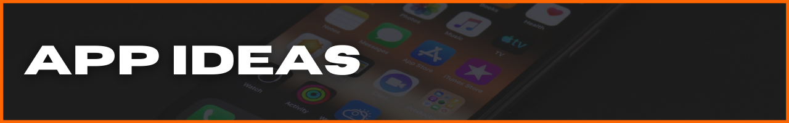

<!-- #region INDEX -->

[App Ideas](#ideas) | [Visualize](#visualize) | [Build](#build) | [Evaluate](#evaluate) | [Market & Sell](#market) | [Community](#community) | [Connect](#connect)

_Originally, I created this repo for keeping track of all the mobile dev resources I use/found. Like a gremlin, it grew into it's own monster and became kind of a mobile-app business outline. Any notes you see in here are written for me, so don't be offended. I'm brutally honest with myself;)_

1. [`App Ideas`](#ideas) &nbsp;&nbsp;|&nbsp;&nbsp; no guessing - systematic approach to identifying & validating .market opportunities
2. [`Visualize`](#visualize) &nbsp;&nbsp;|&nbsp;&nbsp; visualize the solution. visualize the finishline.
3. [`Build`](#build) &nbsp;&nbsp;|&nbsp;&nbsp; get feedback from users ASAFP.
4. [`Evaluate`](#evaluate) &nbsp;&nbsp;|&nbsp;&nbsp; user feedback, product market fit, processes, personal performance (habits)
5. [`Market & Sell`](#market) &nbsp;&nbsp;|&nbsp;&nbsp; clearly & quickly communicate how your app satifies their need.
6. [`Community`](#community) &nbsp;&nbsp;|&nbsp;&nbsp; every ultra-successful person in the world needs a team & mentor(s). you're not special.
7. [`Connect`](#connect)&nbsp;&nbsp;|&nbsp;&nbsp; build the team.

<!-- #endregion /INDEX -->

<!-- #region APP IDEAS -->

<h3 id='ideas'>

</h3>

[App Ideas](#ideas) | [Visualize](#visualize) | [Build](#build) | [Evaluate](#evaluate) | [Market & Sell](#market) | [Community](#community) | [Connect](#connect)

_Create a system to identify & validate ( invalidate ) app ideas. **FAST**._

**MOBILE ANALYTICS & STATS**

**EXISTING USER PAIN POINTS**

**CONDUCTING MARKET ANALYSIS**

**(IN)VALIDATE YOUR IDEA**

> **_NOTE TO SELF:_**
>
> _if I'm in this for the long haul, I have to be the most objective person in the process_
>
> - build interest/user base **_then_** worry about monetizing
> - love the problem, not the idea

<!-- #endregion /APP IDEAS -->

<!-- #region VISUALIZE -->

<h3 id='visualize'>

</h3>

[App Ideas](#ideas) | [Visualize](#visualize) | [Build](#build) | [Evaluate](#evaluate) | [Market & Sell](#market) | [Community](#community) | [Connect](#connect)

_Minimize unecessary decision-making, time-sucks, and low-ROI tasks by creating a system that keeps you focused on the current step's primary objective._

- benchmark dates
- Lean Canvas business plan (**_every_** app is a business)
- **_bare minimum_** v1 requirements (features & functionality)
- required tech resources & architecture
- UI wireframes
- development & testing
- user-testing
- evaluate user-testing feedback
- decide to iterate or start next idea

**BIG PICTURE**

- [Lean Canvas]()

**DEVELOPMENT & TESTING**

- [12-Factor App](https://12factor.net/)
- Architecture Diagrams: [AWS](https://aws.amazon.com/architecture/reference-architecture-diagrams/?whitepapers-main.sort-by=item.additionalFields.sortDate&whitepapers-main.sort-order=desc&awsf.whitepapers-tech-category=*all&awsf.whitepapers-industries=*all&solutions-all.sort-by=item.additionalFields.sortDate&solutions-all.sort-order=desc), [Azure](https://docs.microsoft.com/en-us/azure/architecture/browse/)
- _(add user testing & feedback)_

**GRAPHIC ASSETS**

- [creating a logo](https://designschool.canva.com/courses/creating-a-logo/?lesson=the-how-and-why-of-designing-logos)

**PROJECT / REQUIREMENTS MANAGEMENT**

- [Azure DevOps](https://azure.microsoft.com/en-us/services/devops/?nav=min)
- [Trello](https://trello.com/)

**UI / UX**

- Android: [App quality guidelines](https://developer.android.com/quality), [Material Design guidelines](https://material.io/design), [Material Design components](https://material.io/develop/android)
- iOS: [Human Interface guidelines](https://developer.apple.com/design/human-interface-guidelines/ios/overview/themes/)

> **_NOTE TO SELF:_**
>
> - micro-slow, macro-fast
> - when it comes to learning, times practiced trumps time spent. **_it's all about the reps!_**

<!-- #endregion /VISUALIZE -->

<!-- #region BUILD -->

<h3 id='build'>

</h3>

[App Ideas](#ideas) | [Visualize](#visualize) | [Build](#build) | [Evaluate](#evaluate) | [Market & Sell](#market) | [Community](#community) | [Connect](#connect)

_Establish a build process that focuses on progress & leaves no time for perfection. "Perfect" is the enemy of "done"._

**ENVIRONMENTS & TOOLS**

- [Azure Data Studio](https://docs.microsoft.com/en-us/sql/azure-data-studio/?view=sql-server-ver15)
- [Flipper](https://fbflipper.com/)
- [Reactotron](https://github.com/infinitered/reactotron)
- [Insomnia](https://docs.insomnia.rest/insomnia/get-started)
- [Postman](https://learning.postman.com/docs/getting-started/introduction/)
- [Visual Studio Code](https://code.visualstudio.com/docs)
- [XCode](https://developer.apple.com/documentation/xcode/)

**READ THE F\*CK!NG MANUAL**

- Android: [Android Studio](https://developer.android.com/docs), [API reference](https://developer.android.com/reference), [Kotlin](https://developer.android.com/kotlin)
- Expo: [docs](https://docs.expo.io/)
- iOS: [Swift docs](https://developer.apple.com/documentation/swift), [release notes](https://developer.apple.com/documentation/ios-ipados-release-notes)
- React: [docs](https://reactjs.org/docs), [repo](https://github.com/facebook/react)
- React Native: [docs](http://reactnative.dev/docs/getting-started), [repo](https://github.com/facebook/react-native/), [community repo](https://github.com/react-native-community), [community releases](https://github.com/react-native-community/releases)

**STREAMLINE**

- Project Boilerplates: [Ignite](https://github.com/infinitered/ignite), [react-native-boilerplate](https://github.com/thecodingmachine/react-native-boilerplate/tree/master/template), [react-native-template-typescript](https://github.com/react-native-community/react-native-template-typescript)

> **_NOTE TO SELF:_**
>
> - value your time. smart people to ask for help.
> - ready to rage? do **_anything_** else. ( to calm you down )
> - slow is smooth. smooth is fast. ( "micro slow - macro fast" )
> - [ work on your EQ, Smith ]

<!-- #endregion /BUILD -->

<!-- #region EVALUATE -->

<h3 id='evaluate'>

</h3>

[App Ideas](#ideas) | [Visualize](#visualize) | [Build](#build) | [Evaluate](#evaluate) | [Market & Sell](#market) | [Community](#community) | [Connect](#connect)

**_Awareness_** is the differentiator. Reflect on & critique **_every_** step of every process. wash. rinse. repeat.

**APP PERFORMANCE IN STORES**

**COMMUNITY ENGAGEMENT**

**IN-APP USER METRICS**

**PERSONAL HABITS & PROCESSES**

**WEB PRESENCE**

<!-- #endregion /EVALUATE -->

<!-- #region MARKET & SELL -->

<h3 id='market'>

</h3>

[App Ideas](#ideas) | [Visualize](#visualize) | [Build](#build) | [Evaluate](#evaluate) | [Market & Sell](#market) | [Community](#community) | [Connect](#connect)

_You're not building a mobile app. You're building a solution to someone's need, want, or desire. Be obnoxiously clear about the problem that the app solves. Feature. Advantage. Benefit._

_"I **NEED** that!" vs. "What does it do, again?"_

**MARKETING**

- Personal Channels

- Public Channels

- User Personas / Human Universals

- Web Presence

**DISTRIBUTION**

- Apple Store: [Developers](https://developer.apple.com/app-store/), [Developer Program](https://developer.apple.com/programs/whats-included/), [Connect API](https://developer.apple.com/documentation/appstoreconnectapi)

- Google Play Store: [Console](https://developer.android.com/distribute/console?hl=ru), [Services](https://developer.android.com/distribute/play-services?hl=ru)

**SALES**

- Conversion Analytics

- Features, Advantages, Benefits

- Genuine Value Prop

- Monetization Strategy

- Sales Tracking

- [Accelerate the Sale](https://www.amazon.com/Accelerate-Sale-Kick-Start-Personal-Selling/dp/0071760407) | book by Mark Rogers

<!-- #endregion /MARKET & SELL -->

<!-- #region COMMUNITY -->

<h3 id='community'>

</h3>

[App Ideas](#ideas) | [Visualize](#visualize) | [Build](#build) | [Evaluate](#evaluate) | [Market & Sell](#market) | [Community](#community) | [Connect](#connect)

_To build anything of significance, you need to connect with the users & people who are smarter & more experienced than you._

**INFORMATION / NEWS**

- [Awesome React Weekly](https://react.libhunt.com/newsletter/archive)
- [React Podcast](https://reactpodcast.simplecast.com/)
- [React Round Up](https://devchat.tv/podcasts/react-round-up/)
- [React Wednesdays](https://www.telerik.com/react-wednesdays)
- [React Native blog](https://reactnative.dev/blog)
- [React Native Now](https://reactnativenow.com/issues)
- [React Native Radio](https://reactnativeradio.com/)
- [The React Native Show](https://callstack.com/podcast-react-native-show)

**MOBILE DEV COMPANIES**

- [Callstack.io](https://www.callstack.com/)
- [Infinite Red](https://infinite.red/)

**OPEN-SOURCE**

- [40 Best Free And Open Source Android Apps in 2022](https://antonyagnel.com/best-free-and-open-source-android-apps/)
- [open-source React Native apps](https://github.com/ReactNativeNews/React-Native-Apps) repo

<!-- #endregion /COMMUNITY -->

<!-- #region CONNECT -->

<h3 id='connect'>

</h3>

[App Ideas](#ideas) | [Visualize](#visualize) | [Build](#build) | [Evaluate](#evaluate) | [Market & Sell](#market) | [Community](#community) | [Connect](#connect)

_Build the network. Succeed together._

<table align='center'>
  <tr >
    <td style="border: none;"></td> 
    <td style="border: none;"></td>                      
    <td style="border: none;"></td>  
    <td style="border: none;"></td>
    <td style="border: none;"></td>
  </tr>
</table>

<!-- #endregion /CONNECT -->
