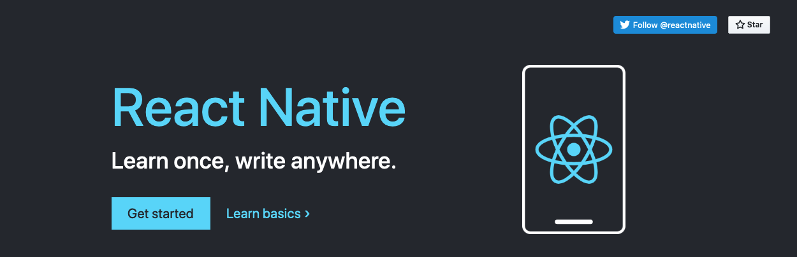
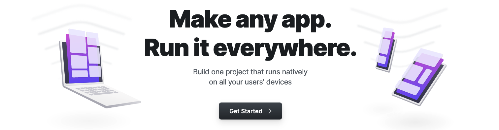
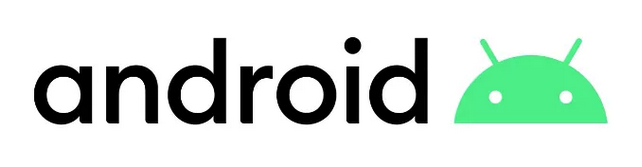
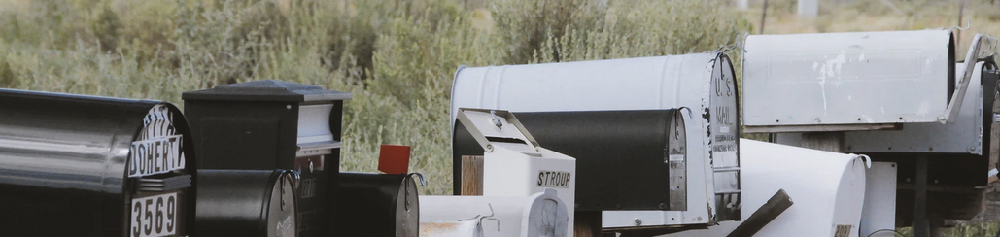

banner bg-img by [Rami Al-zayat](https://unsplash.com/@rami_alzayat?utm_source=unsplash&utm_medium=referral&utm_content=creditCopyText) on [Unsplash](https://unsplash.com/s/photos/smartphone?utm_source=unsplash&utm_medium=referral&utm_content=creditCopyText)

mobile development resources I've used at some point. no particular order. additions welcome.

# **REACT NATIVE**

- [docs](http://reactnative.dev/docs/getting-started)
- [repo](https://github.com/facebook/react-native/)
- [blog](https://reactnative.dev/blog)
- [community repo](https://github.com/react-native-community)
- [releases](https://github.com/react-native-community/releases)
- [open-source apps](https://github.com/ReactNativeNews/React-Native-Apps) repo
- [Ignite](https://github.com/infinitered/ignite) boilerplate by [Infinite Red](https://infinite.red/)
- [react-native-boilerplate](https://github.com/thecodingmachine/react-native-boilerplate/tree/master/template) by [The Coding Machine](https://www.thecodingmachine.com/en/home-2/)
- [react-native-template-typescript](https://github.com/react-native-community/react-native-template-typescript)

# **REACT**

- [docs](https://reactjs.org/docs)
- [repo](https://github.com/facebook/react)

# **EXPO**

- [docs](https://docs.expo.io/)

# **ANDROID**

- [Android Studio docs](https://developer.android.com/docs)
- [Build Your First App](https://developer.android.com/training/basics/firstapp)
- [Kotlin docs](https://developer.android.com/kotlin)
- [Android API reference](https://developer.android.com/reference)
- [Material Design guidelines](https://material.io/design)
- [Material Design components](https://material.io/develop/android)
- [App quality guidelines](https://developer.android.com/quality)
- GOOGLE PLAY STORE
  - [Console](https://developer.android.com/distribute/console?hl=ru)
  - [Services](https://developer.android.com/distribute/play-services?hl=ru)

# **iOS**

- [XCode docs](https://developer.apple.com/documentation/xcode/)
- [Swift docs](https://developer.apple.com/documentation/swift)
- [iOS/iPadOS release notes](https://developer.apple.com/documentation/ios-ipados-release-notes)
- [Human Interface guidelines](https://developer.apple.com/design/human-interface-guidelines/ios/overview/themes/)
- APP STORE
  - [App Store for Developers](https://developer.apple.com/app-store/)
  - [App Developer Program](https://developer.apple.com/programs/whats-included/)
  - [Connect API](https://developer.apple.com/documentation/appstoreconnectapi)

# **PODCASTS**

Photo by [Mohammad Metri](https://unsplash.com/@mohammadmetri?utm_source=unsplash&utm_medium=referral&utm_content=creditCopyText)
on [Unsplash](https://unsplash.com/s/photos/podcast?utm_source=unsplash&utm_medium=referral&utm_content=creditCopyText)

- [The React Native Show](https://callstack.com/podcast-react-native-show) hosted by [Callstack](https://callstack.com/)
- [React Native Radio](https://reactnativeradio.com/) hosted by [Infinite Red](http://infinite.red/)
- [React Round Up](https://devchat.tv/podcasts/react-round-up/) by [devchat.tv](https://devchat.tv/)
- [React Podcast](https://reactpodcast.simplecast.com/) hosted by [React Training](https://reacttraining.com/)
- [React Wednesdays](https://www.telerik.com/react-wednesdays) on Twitch hosted by [@tjvantoll](https://twitter.com/tjvantoll)
- [Junior To Senior](https://juniortosenior.io/) hosted by [@davidguttman](https://twitter.com/davidguttman)

# **NEWSLETTERS**

Photo by [Yannik Mika](https://unsplash.com/@yannikm?utm_source=unsplash&utm_medium=referral&utm_content=creditCopyText) on [Unsplash](https://unsplash.com/s/photos/newsletter?utm_source=unsplash&utm_medium=referral&utm_content=creditCopyText)

- [React Native Now](https://reactnativenow.com/issues)
- [Awesome React Weekly](https://react.libhunt.com/newsletter/archive)
