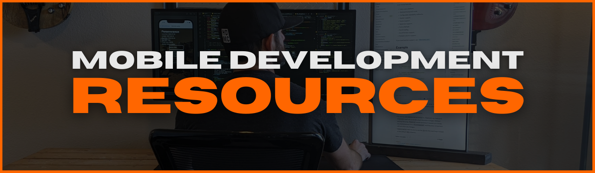

- [Coming Up With App Ideas](#finding-ideas) -- love the **_PROBLEM_** - not your app
- [Validate Your Idea](#app-validation) -- aka. **_INVALIDATE_** your idea
- [Business](#business) -- treat **_EVERY_** app like one
- [Manage Your Time](#time-management) -- give yourself a chance to succeed
- [Design](#design) -- create engaging apps, logos, and **_EXPERIENCES_**
- [Develop the App](#development) -- but do it **_FAST_**
- [Marketing & Sales](#marketing-sales) -- dev skills + salesmanship = **_SUPER-POWER_**
- [publish](#publish) -- "published" is just the **_BEGINNING_**
- [Analytics](#analytics) -- knowing **_HOW_** people actually use your app = new **_OPPORTUNITES_**
- [Community](#community) -- succeed **_TOGETHER_**

<h3 id='finding-ideas'>

</h3>

[Ideas](#finding-ideas) | [Validation](#app-validation) | [Business](#business) | [Time Mgmt](#time-management) | [Design](#design) | [Development](#development) | [Publish](#publish) | [Marketing](#marketing-sales) | [Analytics](#analytics) | [Community](#community)

<h3 id='app-validation'>

</h3>

[Ideas](#finding-ideas) | [Validation](#app-validation) | [Business](#business) | [Time Mgmt](#time-management) | [Design](#design) | [Development](#development) | [Publish](#publish) | [Marketing](#marketing-sales) | [Analytics](#analytics) | [Community](#community)

<h3 id='business'>

</h3>

[Ideas](#finding-ideas) | [Validation](#app-validation) | [Business](#business) | [Time Mgmt](#time-management) | [Design](#design) | [Development](#development) | [Publish](#publish) | [Marketing](#marketing-sales) | [Analytics](#analytics) | [Community](#community)

<h3 id='time-management'>

</h3>

[Ideas](#finding-ideas) | [Validation](#app-validation) | [Business](#business) | [Time Mgmt](#time-management) | [Design](#design) | [Development](#development) | [Publish](#publish) | [Marketing](#marketing-sales) | [Analytics](#analytics) | [Community](#community)

- [Azure DevOps Boards](https://azure.microsoft.com/en-us/services/devops/?nav=min)
- [Trello](https://trello.com/)

<h3 id='design'>

</h3>

[Ideas](#finding-ideas) | [Validation](#app-validation) | [Business](#business) | [Time Mgmt](#time-management) | [Design](#design) | [Development](#development) | [Publish](#publish) | [Marketing](#marketing-sales) | [Analytics](#analytics) | [Community](#community)

- [Material Design guidelines](https://material.io/design)
- [Material Design components](https://material.io/develop/android)
- [App quality guidelines](https://developer.android.com/quality)
- [Human Interface guidelines](https://developer.apple.com/design/human-interface-guidelines/ios/overview/themes/)
- [creating a logo](https://designschool.canva.com/courses/creating-a-logo/?lesson=the-how-and-why-of-designing-logos)

<h3 id='development'>

</h3>

[Ideas](#finding-ideas) | [Validation](#app-validation) | [Business](#business) | [Time Mgmt](#time-management) | [Design](#design) | [Development](#development) | [Publish](#publish) | [Marketing](#marketing-sales) | [Analytics](#analytics) | [Community](#community)

- React Native [docs](http://reactnative.dev/docs/getting-started)
- React Native [repo](https://github.com/facebook/react-native/)
- [Ignite](https://github.com/infinitered/ignite) boilerplate by [Infinite Red](https://infinite.red/)
- [react-native-boilerplate](https://github.com/thecodingmachine/react-native-boilerplate/tree/master/template) by [The Coding Machine](https://www.thecodingmachine.com/en/home-2/)
- [react-native-template-typescript](https://github.com/react-native-community/react-native-template-typescript)
- React [docs](https://reactjs.org/docs)
- React [repo](https://github.com/facebook/react)
- [Android Studio docs](https://developer.android.com/docs)
- [Build Your First App](https://developer.android.com/training/basics/firstapp)
- [Kotlin docs](https://developer.android.com/kotlin)
- [Android API reference](https://developer.android.com/reference)
- Expo [docs](https://docs.expo.io/)
- [XCode docs](https://developer.apple.com/documentation/xcode/)
- [Swift docs](https://developer.apple.com/documentation/swift)
- [iOS/iPadOS release notes](https://developer.apple.com/documentation/ios-ipados-release-notes)

<h3 id='marketing-sales'>

</h3>

[Ideas](#finding-ideas) | [Validation](#app-validation) | [Business](#business) | [Time Mgmt](#time-management) | [Design](#design) | [Development](#development) | [Publish](#publish) | [Marketing](#marketing-sales) | [Analytics](#analytics) | [Community](#community)

<h3 id='publish'>

</h3>

[Ideas](#finding-ideas) | [Validation](#app-validation) | [Business](#business) | [Time Mgmt](#time-management) | [Design](#design) | [Development](#development) | [Publish](#publish) | [Marketing](#marketing-sales) | [Analytics](#analytics) | [Community](#community)

- GOOGLE PLAY STORE
  - [Console](https://developer.android.com/distribute/console?hl=ru)
  - [Services](https://developer.android.com/distribute/play-services?hl=ru)
- APP STORE
  - [App Store for Developers](https://developer.apple.com/app-store/)
  - [App Developer Program](https://developer.apple.com/programs/whats-included/)
  - [Connect API](https://developer.apple.com/documentation/appstoreconnectapi)

<h3 id='analytics'>

</h3>

[Ideas](#finding-ideas) | [Validation](#app-validation) | [Business](#business) | [Time Mgmt](#time-management) | [Design](#design) | [Development](#development) | [Publish](#publish) | [Marketing](#marketing-sales) | [Analytics](#analytics) | [Community](#community)

<h3 id='community'>

</h3>

[Ideas](#finding-ideas) | [Validation](#app-validation) | [Business](#business) | [Time Mgmt](#time-management) | [Design](#design) | [Development](#development) | [Publish](#publish) | [Marketing](#marketing-sales) | [Analytics](#analytics) | [Community](#community)

- React Native [blog](https://reactnative.dev/blog)
- React Native [community repo](https://github.com/react-native-community)
- React Native Community [releases](https://github.com/react-native-community/releases)
- [open-source apps](https://github.com/ReactNativeNews/React-Native-Apps) repo
- [The React Native Show](https://callstack.com/podcast-react-native-show) hosted by [Callstack](https://callstack.com/)
- [React Native Radio](https://reactnativeradio.com/) hosted by [Infinite Red](http://infinite.red/)
- [React Round Up](https://devchat.tv/podcasts/react-round-up/) by [devchat.tv](https://devchat.tv/)
- [React Podcast](https://reactpodcast.simplecast.com/) hosted by [React Training](https://reacttraining.com/)
- [React Wednesdays](https://www.telerik.com/react-wednesdays) on Twitch hosted by [@tjvantoll](https://twitter.com/tjvantoll)
- [React Native Now](https://reactnativenow.com/issues)
- [Awesome React Weekly](https://react.libhunt.com/newsletter/archive)
