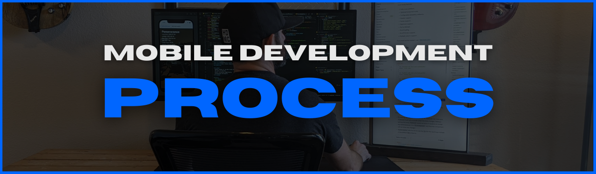
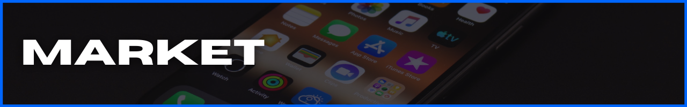

<!-- #region INDEX -->

:bangbang: _I struggle to stay focused for long periods of time. originally created this repo as a tool to "short circuit" my brain when I get distracted. notes are written as advice to my younger self. ( you've been warned ;) [hit me up](mailto:feedback@modevx.com) if you find this useful, have feedback, or advice._ :bangbang:

1. [`Discover`](#discover)
2. [`Visualize`](#visualize)
3. [`Build`](#build)
4. [`Market`](#market)
5. [`Deploy`](#deploy)
6. [`Evaluate`](#evaluate)

- [`~ Connect ~`](#connect)

<!-- #endregion /INDEX -->

<!-- #region DISCOVER -->

<h3 id='discover'>

</h3>

[Discover](#discover) | [Visualize](#visualize) | [Build](#build) | [Market](#market) | [Deploy](#deploy) | [Evaluate](#evaluate) | [Connect](#connect)

<table align='center'>
  <tr >
    <td style="border: none;"></td> 
    <td style="border: none;"></td>                      
    <td style="border: none;"></td>  
    <td style="border: none;"></td>
    <td style="border: none;"></td>
  </tr>
</table>

:bangbang: _you're **NOT** building a **MOBILE APP**. you're building a **SOLUTION**. love the **PROBLEM**. **NOT** your brain baby._ :bangbang:

( _**Sort Order:** process_ )

Find Problems (ie. app ideas)

- [data.ai](https://www.data.ai/en/apps/ios/top/store-rank/feed/free/united-states/overall/ios-phone/) -- free analytics availabe w/out having to signup
- [Google Play Store](https://play.google.com/store/apps/top) appreviews
- [Apple Store]() app reviews
  - [theappstore.org](https://theappstore.org/) - requires turning off ad-blockers
  - [iTunes Search API](https://affiliate.itunes.apple.com/resources/documentation/itunes-store-web-service-search-api/) - endpoint for searching
  - [find.io](https://fnd.io/#/us/charts/iphone/top-grossing/all) - lets you search the iOS app charts without having to open iTunes on your device

Validate Your Solution

**Know** people want it before writing any code.

objectively attempt to INVALIDATE your idea - if you can't, it's go time

- **COMPETITIVE MARKET ANALYSIS**

- **SWAT**

- **LEAN CANVAS**

Maintain Awareness

**INFORMATION / NEWS**

- [Awesome React Weekly](https://react.libhunt.com/newsletter/archive)
- [React Podcast](https://reactpodcast.simplecast.com/)
- [React Round Up](https://devchat.tv/podcasts/react-round-up/)
- [React Wednesdays](https://www.telerik.com/react-wednesdays)
- [React Native blog](https://reactnative.dev/blog)
- [React Native Now](https://reactnativenow.com/issues)
- [React Native Radio](https://reactnativeradio.com/)
- [The React Native Show](https://callstack.com/podcast-react-native-show)

**MOBILE DEV COMPANIES**

- [Callstack.io](https://www.callstack.com/)
- [Infinite Red](https://infinite.red/)

**OPEN-SOURCE**

- [40 Best Free And Open Source Android Apps in 2022](https://antonyagnel.com/best-free-and-open-source-android-apps/)
- [open-source React Native apps](https://github.com/ReactNativeNews/React-Native-Apps) repo

<!-- #endregion /DISCOVER -->

<!-- #region VISUALIZE -->

<h3 id='visualize'>

</h3>

[Discover](#discover) | [Visualize](#visualize) | [Build](#build) | [Market](#market) | [Deploy](#deploy) | [Evaluate](#evaluate) | [Connect](#connect)

<table align='center'>
  <tr >
    <td style="border: none;"></td> 
    <td style="border: none;"></td>                      
    <td style="border: none;"></td>  
    <td style="border: none;"></td>
    <td style="border: none;"></td>
  </tr>
</table>

:bangbang: _consistent, successful execution requires **DEFINING THE TARGET** at **EVERY** lifecycle phase_ :bangbang:

( _**Sort Order:** process_ )

[ Features & Requirements ]

UI / UX Design

## **ANDROID**

- [App quality guidelines](https://developer.android.com/quality)
- [Material Design guidelines](https://material.io/design)
- [Material Design components](https://material.io/develop/android)

## **iOS**

- [Human Interface guidelines](https://developer.apple.com/design/human-interface-guidelines/ios/overview/themes/)

## **GRAPHIC ASSETS**

- [creating a logo](https://designschool.canva.com/courses/creating-a-logo/?lesson=the-how-and-why-of-designing-logos)

## **DESIGN**

- [Bootswatch](https://bootswatch.com/) | free Bootstrap themes
- [Figma community](https://www.figma.com/community) | insperation goldmine design systems, wireframes, mobile design, web, ui kits

App Architecture

- [12-Factor App](https://12factor.net/)
- Architecture Diagrams: [AWS](https://aws.amazon.com/architecture/reference-architecture-diagrams/?whitepapers-main.sort-by=item.additionalFields.sortDate&whitepapers-main.sort-order=desc&awsf.whitepapers-tech-category=*all&awsf.whitepapers-industries=*all&solutions-all.sort-by=item.additionalFields.sortDate&solutions-all.sort-order=desc), [Azure](https://docs.microsoft.com/en-us/azure/architecture/browse/)

Project / Schedule Management

- [Azure DevOps](https://azure.microsoft.com/en-us/services/devops/?nav=min)
- [GitHub Projects](https://docs.github.com/en/issues/trying-out-the-new-projects-experience/about-projects)
- [Trello](https://trello.com/)

Branding & Promotional Assets

- [Canva](canva.com)

<!-- #endregion /VISUALIZE -->

<!-- #region BUILD -->

<h3 id='build'>

</h3>

[Discover](#discover) | [Visualize](#visualize) | [Build](#build) | [Market](#market) | [Deploy](#deploy) | [Evaluate](#evaluate) | [Connect](#connect)

<table align='center'>
  <tr >
    <td style="border: none;"></td> 
    <td style="border: none;"></td>                      
    <td style="border: none;"></td>  
    <td style="border: none;"></td>
    <td style="border: none;"></td>
  </tr>
</table>

:bangbang: _focus on **OUTPUT.** not **INPUT.**_ :bangbang:

( _**Sort Order:** alphabetical_ )

App Boilerplates

- [`ignite`](https://github.com/infinitered/ignite)
- [`react-native-boilerplate`](https://github.com/thecodingmachine/react-native-boilerplate/tree/master/template)
- [`react-native-template-typescript`](https://github.com/react-native-community/react-native-template-typescript)

Debugging

- [Flipper](https://fbflipper.com/)
- [Reactotron](https://github.com/infinitered/reactotron)
- [`react-devtools`](https://github.com/facebook/react/tree/main/packages/react-devtools)

Development Environments

- [Azure Data Studio](https://docs.microsoft.com/en-us/sql/azure-data-studio/?view=sql-server-ver15)
- [Insomnia](https://docs.insomnia.rest/insomnia/get-started)
- [Postman](https://learning.postman.com/docs/getting-started/introduction/)
- [Visual Studio Code](https://code.visualstudio.com/docs)
- [XCode](https://developer.apple.com/documentation/xcode/)

Subject Matter Experts

## **HTML / CSS**

- [Kevin Powel](https://www.youtube.com/kepowob)

## **JavaScript**

- [Brad Traversy](https://www.youtube.com/c/TraversyMedia)

## **React**

- [Jack Herrington](https://www.youtube.com/c/JackHerrington)

Tech Stack Docs

- [Android](https://developer.android.com/reference)
  - [Android Studio](https://developer.android.com/docs)
  - [Kotlin](https://developer.android.com/kotlin)
- [Expo](https://docs.expo.io/)
- [iOS: Swift](https://developer.apple.com/documentation/swift)
  - [release notes](https://developer.apple.com/documentation/ios-ipados-release-notes)
- [React](https://reactjs.org/docs)
  - [repo](https://github.com/facebook/react)
- [React Native](http://reactnative.dev/docs/getting-started)
  - [repo](https://github.com/facebook/react-native/)
  - [components](https://github.com/facebook/react-native/tree/main/Libraries/Components)
  - [community repo](https://github.com/react-native-community)
  - [community releases repo](https://github.com/react-native-community/releases)
  - [`react-native-vector-icons` repo](https://github.com/oblador/react-native-vector-icons)
    - [icon directory](https://oblador.github.io/react-native-vector-icons/)
- [TypeScript](https://www.typescriptlang.org/)
  - [TypeScript + React Native](https://reactnative.dev/docs/typescript)
  - [TypeScript + Expo](https://docs.expo.dev/guides/typescript/)
  - [React/TypeScript cheatsheet](https://github.com/typescript-cheatsheets/react) (_for typing React components_)

Testing

- [Detox](https://github.com/wix/detox/) | mobile app end-to-end testing
- [Jest](https://jestjs.io/)
  - [configure](https://jestjs.io/docs/configuration)
  - [React Native](https://jestjs.io/docs/tutorial-react-native)
  - [Expo](https://docs.expo.dev/guides/testing-with-jest/)
  - [React Navigation](https://reactnavigation.org/docs/testing)
  - [async testing](https://jestjs.io/docs/tutorial-async)
- [`nock`](https://www.npmjs.com/package/nock) | "HTTP server mocking and expectations library for Node.js"
- [React testing docs](https://reactjs.org/docs/testing.html)
  - [recipes for common patterns](https://reactjs.org/docs/testing-recipes.html)
  - [environments](https://reactjs.org/docs/testing-environments.html)
  - [`jest-react`](https://github.com/facebook/react/tree/main/packages/jest-react)
- [React Native testing docs](https://reactnative.dev/docs/testing-overview)
  - [structure](https://reactnative.dev/docs/testing-overview#structuring-tests)
  - [unit](https://reactnative.dev/docs/testing-overview#unit-tests)
  - [integration](https://reactnative.dev/docs/testing-overview#integration-tests)
  - [components](https://reactnative.dev/docs/testing-overview#component-tests)
  - [end-to-end](https://reactnative.dev/docs/testing-overview#end-to-end-tests)
- [`react-native-testing-library` docs](https://callstack.github.io/react-native-testing-library/)
  - [`react-native-testing-library` repo](https://callstack.github.io/react-native-testing-library/)
- [React Query docs](https://react-query.tanstack.com/guides/testing)
  - "[Testing React Query](https://tkdodo.eu/blog/testing-react-query)"

User Interface / Styling

- [React Native component libraries](https://docs.expo.dev/guides/userinterface/)
- "[5 Ways To Improve React Native Styling Workflow](https://reactnavigation.org/docs/testing)" | Shopify
  1. design system: spacing, color, typography
  2. theme object
  3. provide theme using React.Context
  4. break system into components with props that only accept theme values
  5. use responsive styles (aka. breakpoints)
  6. enforce with TypeScript

~ Misc. Tools

- [url encoding](https://ascii.cl/url-encoding.htm)

<!-- #endregion /BUILD -->

<!-- #region MARKET -->

<h3 id='market'>

</h3>

[Discover](#discover) | [Visualize](#visualize) | [Build](#build) | [Market](#market) | [Deploy](#deploy) | [Evaluate](#evaluate) | [Connect](#connect)

<table align='center'>
  <tr >
    <td style="border: none;"></td> 
    <td style="border: none;"></td>                      
    <td style="border: none;"></td>  
    <td style="border: none;"></td>
    <td style="border: none;"></td>
  </tr>
</table>

:bangbang: _an un-marketed mobile app is a hobby project, not a business. "I **NEED** that!" vs. "What does it do, again?"_ :bangbang:

( _**Sort Order:** alphabetical_ )

App Stores

- Apple Store: [Developers](https://developer.apple.com/app-store/), [Developer Program](https://developer.apple.com/programs/whats-included/), [Connect API](https://developer.apple.com/documentation/appstoreconnectapi)

- Google Play Store: [Console](https://developer.android.com/distribute/console?hl=ru), [Services](https://developer.android.com/distribute/play-services?hl=ru)

Product Landing Page

- [Start Bootstrap](https://startbootstrap.com/) | free Bootstrap site templates & themes

Sales

- Conversion Analytics

- Features, Advantages, Benefits

- Genuine Value Prop

- Monetization Strategy

- Sales Tracking

- [Accelerate the Sale](https://www.amazon.com/Accelerate-Sale-Kick-Start-Personal-Selling/dp/0071760407) | book by Mark Rogers

Social Channels

Target Users

- Personas

- Human Universals

<!-- #endregion /MARKET -->

<!-- #region DEPLOY -->

<h3 id='deploy'>

</h3>

[Discover](#discover) | [Visualize](#visualize) | [Build](#build) | [Market](#market) | [Deploy](#deploy) | [Evaluate](#evaluate) | [Connect](#connect)

<table align='center'>
  <tr >
    <td style="border: none;"></td> 
    <td style="border: none;"></td>                      
    <td style="border: none;"></td>  
    <td style="border: none;"></td>
    <td style="border: none;"></td>
  </tr>
</table>

:bangbang: _fast. efficient._ :bangbang:

( _**Sort Order:**: process_ )

Developer Accounts

## **iOS**

- [Apple Developer Program](https://developer.apple.com/)
  - enrollment [requirements](https://developer.apple.com/programs/enroll/)
  - Apple [Agreements & Guidelines](https://developer.apple.com/support/terms/#apple-developer-agreement)
- App Store [Small Business Program](https://developer.apple.com/app-store/small-business-program/)
- [Developing for the Apple App Store](https://www.apple.com/app-store/developing-for-the-app-store/)

## **ANDROID**

- [Google Play Console](https://developer.android.com/distribute/console/)

<!-- #endregion /DEPLOY -->

<!-- #region EVALUATE -->

<h3 id='evaluate'>

</h3>

[Discover](#discover) | [Visualize](#visualize) | [Build](#build) | [Market](#market) | [Deploy](#deploy) | [Evaluate](#evaluate) | [Connect](#connect)

<table align='center'>
  <tr >
    <td style="border: none;"></td> 
    <td style="border: none;"></td>                      
    <td style="border: none;"></td>  
    <td style="border: none;"></td>
    <td style="border: none;"></td>
  </tr>
</table>

:bangbang: _**AWARENESS** is the differentiator. be painfully objective about app performance, opportunities & your output effectiveness & efficiency at **EVERY** step in the process. wash. rinse. repeat._ :bangbang:

( _**Sort Order:** alphabetical_ )

App Store Sales

In-App Metrics

Personal Habits

User Feedback

<!-- #endregion /EVALUATE -->
